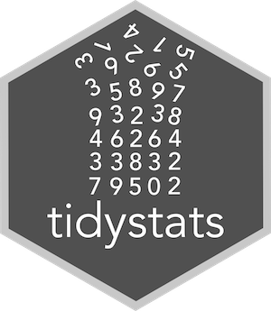
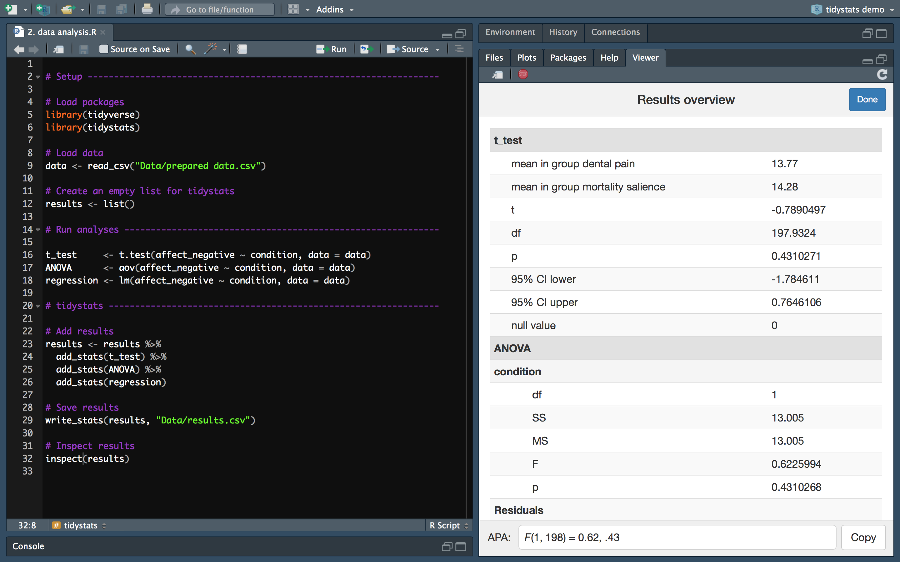

<!-- README.md is generated from README.Rmd. Please edit that file -->

<p align="center">
  
</p>

tidystats
---------------

**Authors:** [Willem Sleegers](http://willemsleegers.com/), [Arnoud Plantinga](http://www.arnoudplantinga.nl/)<br/>
**License:** [MIT](https://opensource.org/licenses/MIT)

`tidystats` is a package to easily create a text file containing the output of 
statistical models. The goal of this package is to help researchers accompany 
their manuscript with an organized data file of statistical results in order to 
greatly improve the reliability of meta-research and to reduce statistical 
reporting errors.

To make this possible, `tidystats` relies on 
[tidy data](http://vita.had.co.nz/papers/tidy-data.html) principles to combine 
the output of statistical analyses such as *t*-tests, correlations, ANOVAs, and 
regression.

Besides enabling you to create an organized data file of statistical results, 
the `tidystats` package also contains functions to help you report statistics in
APA style. Results can be reported using 
[R Markdown](http://rmarkdown.rstudio.com) or using a new built-in Shiny app 
(this is currently only available in the development version). Additionally, 
development has started on a Google Docs plugin that uses a tidystats data file 
to report statistics.

Please see below for instructions on how to install and use this package. 
**Do note that the package is currently in development. This means the package 
may contain bugs and is subject to significant changes.** If you find any bugs 
or if you have any feedback, please let me know by creating an issue here on 
Github (it's really easy to do!).

### Installation

`tidystats` can be installed from CRAN and the latest version can be installed 
from Github using [devtools](https://github.com/hadley/devtools). 

```{r, eval = FALSE}
library(devtools)
install_github("willemsleegers/tidystats")
```

### Setup

Load the package and start by creating an empty list to store the results of 
statistical models in.

```{r setup, warning = FALSE}
library(tidystats)

results <- list()
```

### Usage

The main function is `add_stats()`. The function has 2 necessary arguments:

- `results`: The list you want to add the statistical output to.
- `output`: The output of a statistical test you want to add to the list (e.g., 
the output of `t.test()` or `lm()`)


Optionally you can also add an identifier, type, whether the analysis was 
confirmatory or exploratory, and additional notes using the `identifier`, 
`type`, `confirmatory`, and `notes` arguments, respectively. 

The `identifier` is used to identify the model 
(e.g., 'weight_height_correlation'). If you do not provide one, one is 
automatically created for you.

The `type` argument is used to indicate whether the statistical test is a 
hypothesis test, manipulation check, contrast analysis, or other kind of 
analysis such as descriptives. This can be used to distinguish the vital 
statistical tests from those less relevant.

The `confirmatory` argument is used to indicate whether the test was 
confirmatory or exploratory. It can also be ommitted.

The `notes` argument is used to add additional information which you may find 
fruitful. Some statistical tests have default `notes` output (e.g., t-tests), 
which will be overwritten when a `notes` argument is supplied to the 
`add_stats()` function.

### Supported statistical functions

**Package:** stats

- `t.test()`
- `cor.test()`
- `lm()`
- `aov()`
- `chisq.test()`
- `wilcox.test()`

<!-- **Package:** psych -->

<!-- - `alpha(`) -->
<!-- - `corr.test()` -->

<!-- **Package:** lme4 and lmerTest -->

<!-- - `lmer()` -->

### Example

In the following example we perform several statistical tests on a data set, 
add the output of these results to a list, and save the results to a file.

The data set is called `cox` and contains the data of a replication attempt of 
C.R. Cox, J. Arndt, T. Pyszczynski, J. Greenberg, A. Abdollahi, and S. Solomon 
(2008, JPSP, 94(4), Exp. 6) by Wissink et al. The replication study was part of 
the Reproducibility Project (see https://osf.io/ezcuj/). The data set is part of
the `tidystats` package.

```{r}

# Perform analyses
M1_condition <- t.test(call_parent ~ condition, data = cox, paired = TRUE)
M2_parent_siblings <- cor.test(cox$call_parent, cox$call_siblings, 
                               alternative = "greater")
M3_condition_anxiety <- lm(call_parent ~ condition * anxiety , data = cox)
M4_condition_sex <- aov(call_parent ~ condition * sex, data = cox)

# Add results
results <- results %>%
  add_stats(M1_condition) %>%
  add_stats(M2_parent_siblings) %>%
  add_stats(M3_condition_anxiety) %>%
  add_stats(M4_condition_sex)
```

To write the results to a file, use `write_stats()` with the results list as the
first argument.

```{r, eval = FALSE}
write_stats(results, "data/results.csv")
```

To see how the data was actually tidied, you can open the .csv file or you can 
convert the tidystats results list to a table, as shown below.

```{r, message = FALSE, warning = FALSE}
library(dplyr)
library(knitr)
options(knitr.kable.NA = '-')

results %>%
  stats_list_to_df() %>%
  select(-notes) %>%
  kable()
```

### Report functions

There are two ways to report your results using tidystats: Using R Markdown or 
using a built-in Shiny app. In both cases, you need the tidystats list that 
contains the tidied output of your statistical tests.

If you have previously created a tidystats file, you can read in this file to 
re-create the tidystats list, using the `read_stats()` function.

```{r, eval = FALSE}
results <- read_stats("data/results.csv")
```

#### Shiny app (available in the Github version of tidystats)

If you do not want to use R Markdown, you can use the built-in Shiny app to 
interactively produce APA-output and copy it to your manuscript. To start the
app, run the `inspect()` function. 

The `inspect()` function takes the tidystats list as its first argument, 
optionally followed by one or more identifiers. If no identifiers are provided,
all models will be displayed. The results of each model will be displayed in a 
table and you can click on a row to produce APA output. This APA output will 
appear in a textbox at the bottom, next to a copy button that can be pressed to
copy the results into your clipboard. See below for an example.

<p>
  
</p>

#### R Markdown

You can use the `report()` function to report your results via R Markdown. This 
function requires at minimum the tidystats list and an identifier identifying 
the exact test you want to report. It may also be necessary to provide 
additional information, such as a term in a regression, for the `report()` 
function to figure out what you want to report.

To reduce repetition, you can use `options()` to set the default tidystats list 
to use. This way the `report()` function requires one fewer argument. 
You set the default tidystats list by running the following code:

```{r}
options(tidystats_list = results)
```

To figure out how to report the output in APA style, the `report()` function 
uses the **method** information stored in the tidied model. For example, the 
model with identifier 'M1' is a paired t-test. `report()` will parse this, 
see that it is part of the t-test family, and produce results accordingly. 

Below is a list of common report examples:

| code                                                         | output                                                          |
|--------------------------------------------------------------|-----------------------------------------------------------------|
|`report("M1_condition")`                                       | `r report("M1_condition")`                                       |
|`report("M1_condition", statistic = "t")`                      | `r report("M1_condition", statistic = "t")`                      |
|`report("M2_parent_siblings")`                                       | `r report("M2_parent_siblings")`                                       |
|`report("M3_condition_anxiety", term = "conditionmortality salience")` | `r report("M3_condition_anxiety", term = "conditionmortality salience")` |
|`report("M3_condition_anxiety", term_nr = 2)`                           | `r report("M3_condition_anxiety", term_nr = 2)`                          |
|`report("M3_condition_anxiety", term = "(Model)")`                     | adjusted *R*<sup>2</sup> = .0035, *F*(1, 198) = 1.70, *p* = .19                     |
|`report("M4_condition_sex", term = "condition:sex")`               | `r report("M4_condition_sex", term = "condition:sex")`               |

As you can see in the examples above, you can use `report()` to produce a full 
line of output. You can also retrieve a single statistic by using the 
`statistic` argument. Additionally, you can refer to terms using either the 
term label or the term number (and in some cases, using a group). Although it
may be less descriptive to use a term number, it reduces the amount of code 
clutter in your Markdown document. Our philosophy is, in line with Markdown's 
general writing philosophy, that the code should not distract from writing. To 
illustrate, writing part of a results section will now, using `tidystats` look 
like this:

> We found no significant difference between the mortality salience condition 
and the dental pain condition on the number of minutes allocated to calling 
one's parents, <code>r report("M1_condition")</code>.

To execute the code, the code segment should be surrounded by backward ticks 
(see http://rmarkdown.rstudio.com/lesson-4.html), which results in:

> We found no significant difference between the mortality salience condition 
and the dental pain condition on the number of minutes allocated to calling 
one's parents, `r report("M1_condition")`.

### Helper functions

#### Descriptives

Since it's common to also report descriptives in addition to the statistical 
results, we have added a hopefully useful `describe_data()` and `count_data()` 
function to calculate common descriptive statistics that can be tidied and added
to a results data frame. Several examples follow using the `cox` data.

```{r}
# Descriptives of the 'anxiety' variable
describe_data(cox, anxiety)
```

```{r}
# By condition
cox %>%
  group_by(condition) %>%
  describe_data(anxiety)
```

```{r}
# Descriptives of a non-numeric variable
count_data(cox, condition)
```

If you use the `describe_data()` and `count_data()` function from the 
`tidystats` package to get the descriptives, you can use the 
`tidy_describe_data()` and `tidy_count_data()` function to tidy the output, and
consequently add it to a results list.

(Note: This will soon be improved)

```{r}
anxiety_tidy <- cox %>%
  describe_data(anxiety) %>%
  tidy_describe_data()

results <- results %>%
  add_stats(anxiety_tidy, type = "d", notes = "Anxious attachment style")
```
In the `add_stats()` function you can also specify which of the statistics you 
would like to store in the results list, using the `statistics` argument. Of 
course, the results can also be tidied when the data is grouped.