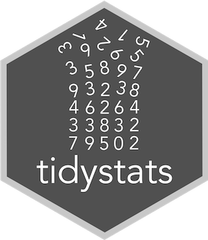

<!-- README.md is generated from README.Rmd. Please edit that file -->



tidystats
---------------

**Authors:** [Willem Sleegers](http://willemsleegers.com/), [Arnoud Plantinga](http://www.arnoudplantinga.nl/)<br/>
**License:** [MIT](https://opensource.org/licenses/MIT)

`tidystats` is a package to easily create a text file containing the output of statistical models. The goal of this package is to help researchers accompany their manuscript with an organized data file of statistical results in order to greatly improve the reliability of meta-research and to reduce statistical reporting errors.

To make this possible, `tidystats` relies on [tidy data](http://vita.had.co.nz/papers/tidy-data.html) principles to combine the output of statistical analyses such as *t*-tests, correlations, ANOVAs, and regression analyses.

Besides enabling you to create an organized data file of statistical results, the `tidystats` package also contains functions to help you report statistics in APA style using [R Markdown](http://rmarkdown.rstudio.com). Additionally, development has started on a Shiny app and a Google Docs plugin that uses a tidystats data file to report statistics.

Please see below for instructions on how to install and use this package. **Do note that the package is currently in development and may contain bugs.** If you find any, please let me know by creating an issue here on Github (it's really easy to do!).

### Installation

`tidystats` can be installed from CRAN, but the latest version can be installed from Github using [devtools](https://github.com/hadley/devtools). 

```{r, eval = FALSE}
library(devtools)
install_github("willemsleegers/tidystats")
```

### Setup

Load the package and start by creating an empty list to store the results of statistical models in.

```{r setup, warning = FALSE}
library(tidystats)

results <- list()
```

### Usage

The main function is `add_stats()`. The function has 2 necessary arguments:

- `output`: The output of a statistical test you want to add to the list (e.g., the output of `t.test()` or `lm()`)
- `results`: The list you want to add the statistical output to

Optionally you can also add an identifier, type, a subset of the statistics, whether the analysis was confirmatory or exploratory, and additional notes using the `identifier`, `type`, `statistics`, `confirmatory`, and `notes` arguments, respectively. 

The `identifier` is used to identify the model (e.g., 'weight_height_correlation'). If you do not provide one, one is automatically created for you.

The `type` argument is used to indicate whether the statistical test is a hypothesis test, manipulation check, contrast analysis, or other kind of analysis such as descriptives. This can be used to distinguish the vital statistical tests from those less relevant.

The `statistics` argument is used to select a subset of statistics that you want to add to the results list, in case this is desired.

The `confirmatory` argument is used to indicate whether the test was confirmatory or exploratory. It can also be ommitted.

The `notes` argument is used to add additional information which you may find fruitful. Some statistical tests have default `notes` output (e.g., t-tests), which will be overwritten when a `notes` argument is supplied to the `add_stats()` function.

### Supported statistical functions

**Package:** stats

- `t.test()`
- `cor.test()`
- `lm()`
- `aov()`
- `chisq.test()`
- `wilcox.test()`

### Example

In the following example we perform several statistical tests on a data set, add the output of these results to a list, and save the results to a file.

The data set is called `cox` and contains the data of a replication attempt of C.R. Cox, J. Arndt, T. Pyszczynski, J. Greenberg, A. Abdollahi, and S. Solomon (2008, JPSP, 94(4), Exp. 6) by Wissink et al. The replication study was part of the Reproducibility Project (see https://osf.io/ezcuj/). The data set is part of the `tidystats` package.

```{r}

# Perform analyses
M1_condition <- t.test(call_parent ~ condition, data = cox, paired = TRUE)
M2_parent_siblings <- cor.test(cox$call_parent, cox$call_siblings, alternative = "greater")
M3_condition_anxiety <- lm(call_parent ~ condition * anxiety , data = cox)
M4_condition_sex <- aov(call_parent ~ condition * sex, data = cox)

# Add results
results <- results %>%
  add_stats(M1_condition) %>%
  add_stats(M2_parent_siblings) %>%
  add_stats(M3_condition_anxiety) %>%
  add_stats(M4_condition_sex)
```

Having added the statistical results to the list, you can convert the list to a table or to a data file, ready for sharing. The example below shows how to produce a table containing all of the statistical results.

```{r, message = FALSE, warning = FALSE}
library(dplyr)
library(knitr)
options(knitr.kable.NA = '-')

results %>%
  stats_list_to_df() %>%
  select(-notes) %>%
  kable()
```

To write the results to a file, use `write_stats()` with the results list as the first argument.

```{r, eval = FALSE}
write_stats(results, "data/results.csv")
```

This produces a .csv file that can be shared and that can also be used to write your Results section. The report functions will be demonstrated below.

### Report functions

To start reporting your results, first load in the previously saved data file containing the results. This will create a list, just like it was when it was originally saved.

```{r, eval = FALSE}
results <- read_stats("data/results.csv")
```

Additionally, you can use `options()` to set the default tidystats list to use. This way the `report()` functions below require one fewer argument. You set the default tidystats list by running the following code:

```{r}
options(tidystats_list = results)
```

The main function for reporting is `report()`. To figure out how to report the output in APA style, `tidystats` uses the **method** information stored in the results list. For example, the model with identifier 'M1' is a paired t-test. `tidystats` will parse this, see that it is part of the t-test family, and produce results accordingly. `tidystats()` also has test-specific reporting functions, such as `report_t_test()` that are used under the hood, but they are also available for you to use.

Below we show a list of common report examples:

| code                                                         | output                                                          |
|--------------------------------------------------------------|-----------------------------------------------------------------|
|`report("M1_condition")`                                       | `r report("M1_condition")`                                       |
|`report("M1_condition", statistic = "t")`                      | `r report("M1_condition", statistic = "t")`                      |
|`report("M2_parent_siblings")`                                       | `r report("M2_parent_siblings")`                                       |
|`report("M3_condition_anxiety", term = "conditionmortality salience")` | `r report("M3_condition_anxiety", term = "conditionmortality salience")` |
|`report("M3_condition_anxiety", term_nr = 2)`                           | `r report("M3_condition_anxiety", term_nr = 2)`                          |
|`report("M3_condition_anxiety", term = "(Model)")`                     | adjusted *R*<sup>2</sup> = .0035, *F*(1, 198) = 1.70, *p* = .19                     |
|`report("M4_condition_sex", term = "condition:sex")`               | `r report("M4_condition_sex", term = "condition:sex")`               |

As you can see in the examples above, you can use `report()` to produce a full line of output when a model identifier is provided (and a term when the model consists of multiple terms). You can also only retrieve a single statistic by using the `statistic` argument. Additionally, you can refer to terms using either the term label or the term number. Although this latter method might be less descriptive, it reduces the amount of code clutter in your Markdown document. Our philosophy is, in line with Markdown's general writing philosophy, that the code should not distract from writing. To illustrate, writing part of a results section will now, using `tidystats` look like this:

> We found no significant difference between the mortality salience condition and the dental pain condition on the number of minutes allocated to calling one's parents, <code>r report("M1_condition")</code>.

To execute the code, the code segment should be surrounded by backward ticks (see http://rmarkdown.rstudio.com/lesson-4.html), which results in:

> We found no significant difference between the mortality salience condition and the dental pain condition on the number of minutes allocated to calling one's parents, `r report("M1_condition")`.

### Helper functions

#### Descriptives

Since it's common to also report descriptives in addition to the statistical results, we have added a hopefully useful `describe_data()` and `count_data()` function to calculate common descriptive statistics that can be tidied and added to a results data frame. Several examples follow using the `cox` data.

```{r}
# Descriptives of the 'anxiety' variable
describe_data(cox, anxiety)
```

```{r}
# By condition
cox %>%
  group_by(condition) %>%
  describe_data(anxiety)
```

```{r}
# Descriptives of a non-numeric variable
count_data(cox, condition)
```

If you use the `describe_data()` and `count_data()` function from the `tidystats` package to get the descriptives, you can use the `tidy_describe_data()` and `tidy_count_data()` function to tidy the output, and consequently add it to a results list. 

```{r}
results <- cox %>%
  describe_data(anxiety) %>%
  tidy_describe_data() %>%
  add_stats(results, identifier = "anxiety", type = "d", notes = "Anxious attachment style")
```
In the `add_stats()` function you can also specify which of the statistics you would like to store in the results list, using the `statistics` argument. Of course, the results can also be tidied when the data is grouped.